# Technical Test - Full-Stack Developer RSUP Surabaya

## Deskripsi
Syarat untuk memenuhi technical test Full Stack Developer RSUP Surabaya. Aplikasi mendukung sistem login, manajemen peran pengguna, CRUD data K3, Pengguna, Role dan Role Akses, validasi form, pagination, pencarian, filter data, penghapusan AJAX, unggah file PDF dan gambar, serta REST API.

### **Fitur Web (Frontend dan Backend)**

**Autentikasi Pengguna (Login) dan Pengelolaan Role**

- Fitur Login
Pengguna dapat masuk dan mengakses aplikasi melalui form login diintegrasikan dengan Google reCAPTCHA

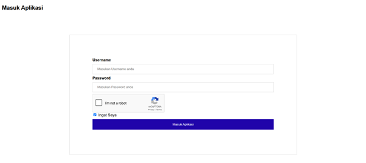

- Role and Permission
Terdapat 3 Role yang memiliki aksesnya masing-masing
-Admin : PUT, POST, GET dan DELETE
-Editor : PUT, POST, GET dan DELETE
-Pengguna : GET

**CRUD (Create Read Update,Delete)**

Sudah terimplementasi CRUD berdasarkan hak aksesnya

Pengguna yang memiliki akses GET saja tidak bisa menambah, edit ataupun menghapus data

**Form Validasi (Backend dan Frontend)**

FRONTEND - pada HTML sudah disesuaikan type datanya sehingga user harus memasukan data sesuai aturan
BACKEND - menggunakan form validasi bawaan CI3 sebagai Form Validasi

**Pengelolaan Data dengan Pagination**

Dapat dilakukan pagination

**Pencarian dan Penyaringan Data**

Dapat dilakukan pencarian data

**AJAX untuk Penghapusan Data**
Telah terimplementasikannya ajax sebagai penghapusan data sehingga tidak perlu memuat ulang halaman

**Fitur Unggah File PDF dan Image**
Pengguna dapat mengunggah berkas PDF dan Image pada menu Data Pelaporan K3

**Screenshoot terkait Aplikasi dan Informasi singkat**
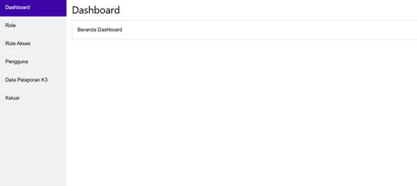
Terdapat 4 menu utama aplikasi, ada Role sebagai Nama Master dari Hak Aksesnya, Role Akses, adalah pemberian Hak Akses ke Pengguna, Pengguna adalah data User yang dapat masuk aplikasi, dan Data Pelaporan K3 sebagai Pelaporan Insiden 

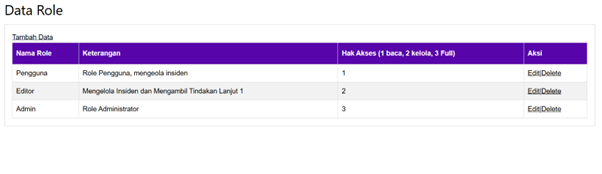
Menggunakan Ajax sebagai mengambil data dan delete data sehingga tidak perlu memuat ulang halaman

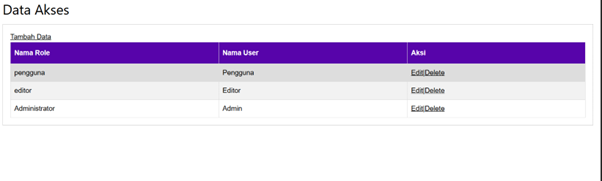
Menggunakan Ajax sebagai mengambil data dan delete data sehingga tidak perlu memuat ulang halaman

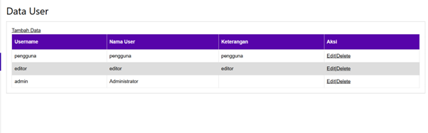
Menggunakan Ajax sebagai mengambil data dan delete data sehingga tidak perlu memuat ulang halaman

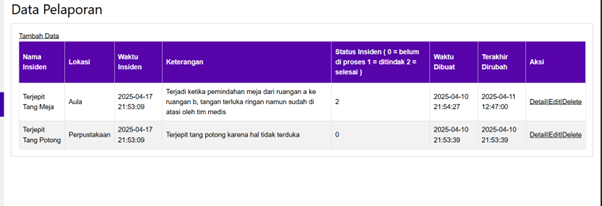
Menggunakan Ajax sebagai mengambil data dan delete data sehingga tidak perlu memuat ulang halaman

### **Backend (REST API dengan PHP)**
**REST API pada CRUD Data**
REST API pada setiap Service sudah tersedia 

- Endpoints API : 

---Pengguna

api/user

api/user/4

api/user

api/user/7

api/user/7

---Menu

api/menu

api/user/4

api/menu

api/menu/6

api/menu/6

---Role

api/role

api/role/4

api/role

api/role/2

api/role/1

---Role Aksies

api/roleAkses

api/roleAkses/4

api/roleAkses

api/roleAkses/2

api/roleAkses/1

---Insiden K3

api/insiden

api/insiden/4

api/insiden

api/insiden/2

api/insiden/3

---Berkas Insinden 

api/insidenberkas/1

api/insidenberkas/1/1

api/insidenberkas/3

api/insidenberkas/2

---Ambil TOKEN

api/auth

**Autentikasi API**

Diimplementasikannya algortima sederhana untuk melindungi endpoint

**Screenshoot terkait Aplikasi dan Informasi singkat**

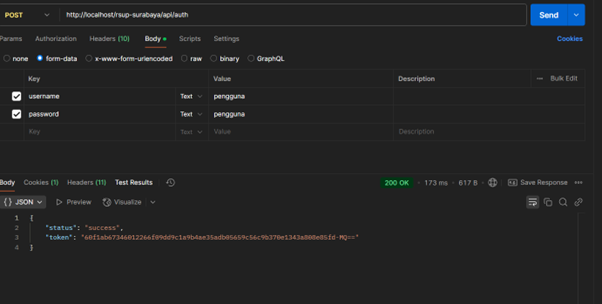
Get token sebagai permintaan awal token 

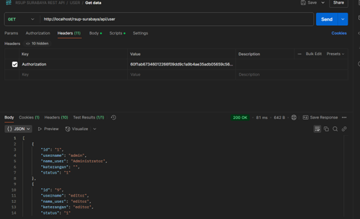
(Wajib Authorization TOKEN) - TOKEN terpasang

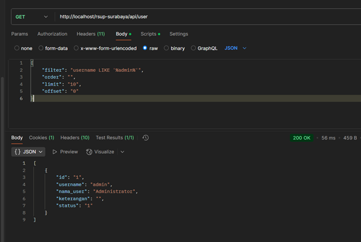
(Wajib Authorization TOKEN) - FILTER DATA

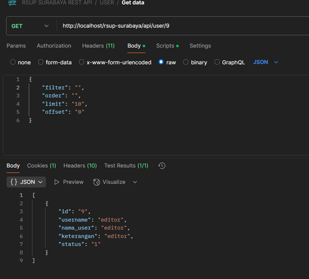
(Wajib Authorization TOKEN) - Spesifik id menambahkan ID User pada URL

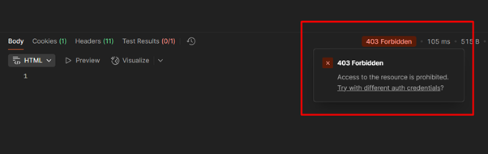
(Wajib Authorization TOKEN) - Jika Tanpa Token

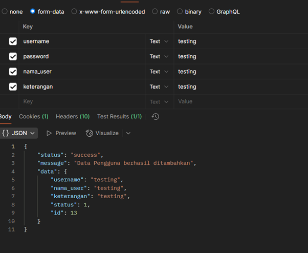
(Wajib Authorization TOKEN) - POST DATA

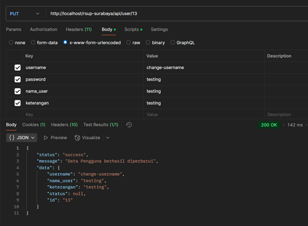
(Wajib Authorization TOKEN) - PUT DATA

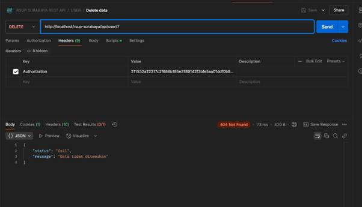
(Wajib Authorization TOKEN) - JIKA DATA TIDAK ADA

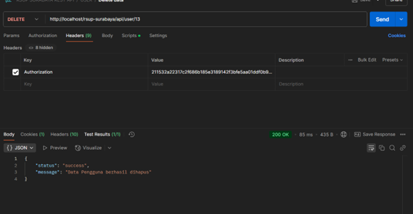
(Wajib Authorization TOKEN) - DELETE DATA

- Konfigurasi url dapat dilakukan di .env 
